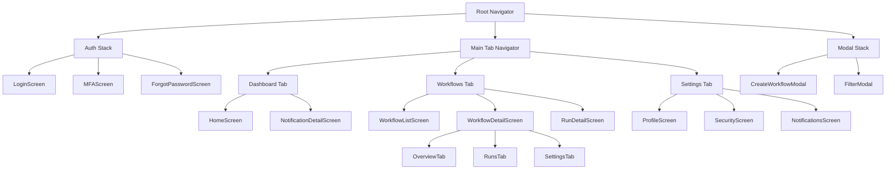
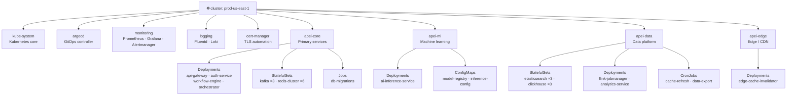

# Solution Architecture — Deep Dive

> **Document Owner:** Platform Architecture Guild | **Classification:** Internal | **Last Updated:** 2026-03-20

## 1. System Layers

The platform is organized into five discrete architectural layers. Each layer has strict dependency rules — a layer may only depend on layers below it, never above.

### 1.1 Presentation Layer

The presentation layer is responsible for all user-facing rendering, interaction handling, and client-side state management.

#### 1.1.1 Web Client

The web client is a React 18 single-page application compiled by Vite and served as static assets via CloudFront.

##### 1.1.1.1 Component Hierarchy

The component tree follows Atomic Design principles across five levels:

- **Atoms** — indivisible UI primitives
  - `Button` — supports `primary`, `secondary`, `danger`, `ghost` variants
    - Props: `label`, `icon`, `loading`, `disabled`, `onClick`, `size`
    - Sizes: `sm (28px)`, `md (36px)`, `lg (44px)`
    - States: default → hover → active → loading → disabled
  - `Badge` — status indicator pill
    - Variants: `success`, `warning`, `error`, `info`, `neutral`
    - Sub-variants for each: `solid`, `outline`, `subtle`
  - `Input` — text input with validation
    - Types supported: `text`, `email`, `password`, `number`, `search`, `url`
    - Validation modes:
      - `eager` — validate on every keystroke
      - `lazy` — validate on blur
      - `submit` — validate only on form submit
  - `Icon` — SVG icon system (1,200+ icons via Lucide)
    - Size tokens: `xs(12)`, `sm(16)`, `md(20)`, `lg(24)`, `xl(32)`

- **Molecules** — composed from atoms
  - `FormField` — label + input + error message
    - Composed of: `Label` atom + `Input` atom + `HelperText` atom
    - Layout variants: `stacked` (label above), `inline` (label beside)
  - `SearchBar` — search input with dropdown results
    - Composed of: `Input` + `Icon` + `Dropdown` + `SearchResult` list
    - Features:
      - Debounced query (150ms default, configurable)
      - Keyboard navigation (↑ ↓ Enter Esc)
      - Result grouping by category
      - Recent searches (persisted to `localStorage`)
  - `NavItem` — sidebar navigation link
    - States: `default`, `active`, `collapsed`, `restricted`
    - Sub-states of `active`:
      - `active-exact` — exact URL match
      - `active-parent` — ancestor of current route

- **Organisms** — complex, self-contained sections
  - `WorkflowEditor` — visual DAG editor for building workflows
    - Sub-components:
      - `NodePalette` — draggable node types
        - Categories: `Triggers`, `Actions`, `Conditions`, `Transformers`, `Outputs`
        - Each category has sub-items (e.g., Triggers → HTTP Webhook, Cron Schedule, Event Bus, File Watch)
      - `Canvas` — infinite pan/zoom canvas (powered by React Flow)
        - Grid system: 20px base grid, snap-to-grid enabled
        - Zoom levels: 10% → 200%, step 10%
      - `NodeInspector` — right-panel config form for selected node
        - Sections: General → Inputs → Outputs → Error Handling → Advanced
      - `EdgeManager` — handles connections between nodes
        - Edge types: `data`, `control`, `error`
        - Validation: prevents cycles, validates type compatibility

- **Templates** — page-level layout scaffolding
  - `DashboardTemplate` — two-column layout (sidebar + content)
  - `FullWidthTemplate` — single column, max-width centered
  - `SplitTemplate` — 50/50 resizable split for editor views

- **Pages** — route-level components
  - `/workflows` → `WorkflowListPage`
  - `/workflows/:id/edit` → `WorkflowEditorPage`
  - `/workflows/:id/runs` → `ExecutionHistoryPage`
  - `/settings/*` → `SettingsPage` (nested routes)

##### 1.1.1.2 State Management Architecture

State is segmented by lifetime and scope:

- **Server state** — managed by TanStack Query (React Query v5)
  - Cache keys follow a hierarchical namespace:
    - `['workflows']` — list
    - `['workflows', id]` — single item
    - `['workflows', id, 'runs']` — paginated runs
    - `['workflows', id, 'runs', runId]` — single run
    - `['workflows', id, 'runs', runId, 'logs']` — streaming logs
  - Stale times:
    - Workflow list: 30 seconds
    - Single workflow: 60 seconds
    - Execution logs: 0 (always fresh, SSE-driven)

- **Client state** — managed by Zustand stores
  - `editorStore` — workflow editor ephemeral state
    - `selectedNodeId: string | null`
    - `selectedEdgeId: string | null`
    - `zoom: number`
    - `panOffset: { x: number, y: number }`
    - `isDirty: boolean`
    - `undoStack: EditorAction[]`
    - `redoStack: EditorAction[]`
  - `uiStore` — global UI state
    - `sidebarOpen: boolean`
    - `theme: 'light' | 'dark' | 'system'`
    - `activeModal: string | null`
    - `toasts: Toast[]`

- **URL state** — managed by `nuqs` (URL search params as state)
  - Page filters (search query, sort, pagination)
  - Tab selections
  - Panel open/closed states (shareable URLs)

- **Form state** — managed by React Hook Form + Zod
  - Schema validation at field, group, and form levels
  - Async validation (e.g., check if workflow name is unique)

#### 1.1.2 Mobile Client

The mobile client is a React Native application targeting iOS 16+ and Android 10+.

##### 1.1.2.1 Navigation Structure



---

### 1.2 API Gateway Layer

The API gateway (Kong) handles all inbound traffic before it reaches any microservice.

#### 1.2.1 Request Processing Pipeline

Every inbound request passes through the following plugin chain in order:

1. **Rate Limiting** (`kong-plugin-rate-limiting-advanced`)
   - Tier 1 — Free plans:
     - Per-second limit: 10 req/s
     - Per-minute limit: 100 req/min
     - Per-hour limit: 2,000 req/hr
     - Burst allowance: 2x for 5 seconds
   - Tier 2 — Pro plans:
     - Per-second limit: 100 req/s
     - Per-minute limit: 2,000 req/min
     - Per-hour limit: 50,000 req/hr
   - Tier 3 — Enterprise plans:
     - Custom limits per contract
     - Negotiated SLAs with dedicated capacity

2. **Authentication** (`kong-plugin-jwt`)
   - Validates JWT signature using RS256 (asymmetric, public key fetched from Auth Service JWKS endpoint)
   - Checks: `exp`, `nbf`, `iss`, `aud`
   - Injects decoded claims as request headers:
     - `X-User-ID`
     - `X-Org-ID`
     - `X-Roles`
     - `X-Plan-Tier`

3. **Authorization** (`custom-lua-plugin`)
   - Route-level permission matrix (RBAC)
   - Checks org-level feature flags (LaunchDarkly)
   - IP allowlist enforcement for `/admin/*` routes

4. **Request Transformation**
   - Adds: `X-Request-ID` (UUID v4), `X-Gateway-Version`, `X-Forwarded-For`
   - Strips: client headers that could interfere with backend logic
   - Normalizes: `Content-Type`, `Accept` headers

5. **Logging** (async, non-blocking)
   - Structured JSON to stdout → Fluentd → CloudWatch Logs
   - Fields: `timestamp`, `request_id`, `method`, `path`, `status`, `latency_ms`, `user_id`, `org_id`

6. **Response Transformation**
   - Injects: `X-Request-ID` echo, `X-RateLimit-Remaining`, `Cache-Control`
   - CORS headers for browser clients

#### 1.2.2 Route Configuration

Routes are organized into service groups:

- **Public routes** (no auth required)
  - `GET /api/v2/health`
  - `POST /api/v2/auth/token`
  - `POST /api/v2/auth/refresh`
  - `GET /api/v2/.well-known/jwks.json`

- **Authenticated routes** (JWT required)
  - **Workflow service** → upstream: `workflow-engine:8080`
    - `GET|POST /api/v2/workflows`
    - `GET|PUT|DELETE /api/v2/workflows/:id`
    - `POST /api/v2/workflows/:id/execute`
  - **Analytics service** → upstream: `analytics-service:8090`
    - `GET /api/v2/analytics/*`
  - **AI service** → upstream: `ai-inference:8100` (requires `ai` scope in JWT)
    - `POST /api/v2/ai/generate`
    - `POST /api/v2/ai/suggest`

- **Admin routes** (JWT + `admin` role + IP allowlist)
  - `GET|POST|DELETE /api/v2/admin/*`

---

### 1.3 Service Layer

#### 1.3.1 Workflow Engine

The workflow engine is the most critical service — it parses, validates, stores, and executes workflow definitions.

##### 1.3.1.1 Execution Model

Workflow execution follows a directed acyclic graph (DAG) model with the following phases:

- **Phase 1: Parse**
  - Input: raw workflow definition (JSON/YAML)
  - Steps:
    1. Schema validation (JSON Schema draft-2020-12)
    2. Reference resolution (expand `$ref` pointers)
    3. Cycle detection (DFS with color marking)
    4. Type checking for all step I/O
  - Output: `ValidatedWorkflowGraph`
  - Error modes:
    - `SCHEMA_VALIDATION_ERROR` — malformed structure
    - `CYCLE_DETECTED_ERROR` — circular dependency found
    - `TYPE_MISMATCH_ERROR` — incompatible step connections

- **Phase 2: Plan**
  - Input: `ValidatedWorkflowGraph` + runtime context
  - Steps:
    1. Topological sort (Kahn's algorithm)
    2. Parallelism analysis — identify independent branches
    3. Resource estimation — predict memory/CPU per step
    4. Secrets resolution — expand `${secrets.X}` references via Vault
  - Output: `ExecutionPlan` (ordered list of `ExecutionGroup`s, each group runs in parallel)

- **Phase 3: Execute**
  - Input: `ExecutionPlan` + trigger payload
  - For each `ExecutionGroup`:
    - Spawn goroutines for each step in the group
    - Each goroutine:
      1. Acquire execution slot from semaphore (concurrency control)
      2. Fetch step handler (plugin lookup by `type`)
      3. Resolve input bindings (JSONPath expressions against prior step outputs)
      4. Invoke handler with timeout context
      5. Validate output against schema
      6. Emit `step.completed` event to Kafka
      7. Release semaphore slot
    - Wait for all goroutines in group to complete
    - On any failure: execute error handler strategy
      - `retry` — exponential backoff (configurable: `initial_delay`, `max_delay`, `max_retries`, `jitter`)
      - `skip` — mark step as skipped, continue DAG
      - `fail_fast` — cancel all in-flight steps, mark execution failed
      - `compensate` — run compensation steps (saga pattern)

- **Phase 4: Finalize**
  - Collect all step outputs into final execution record
  - Calculate execution metadata: `total_duration_ms`, `step_count`, `success_count`, `failure_count`, `skip_count`
  - Persist to PostgreSQL
  - Emit `execution.completed` event
  - Trigger webhooks/notifications if configured

##### 1.3.1.2 Step Handler Plugin System

Step types are implemented as plugins compiled into the engine:

| Category | Step Type | Description | Key Config Fields |
|----------|-----------|-------------|-------------------|
| **Triggers** | `http_webhook` | Receives HTTP requests | `path`, `method`, `auth_type`, `schema` |
| | `cron_schedule` | Time-based trigger | `cron_expression`, `timezone`, `catchup` |
| | `event_bus` | Kafka topic consumer | `topic`, `group_id`, `filter_expression` |
| **Actions** | `http_request` | Outbound HTTP call | `url`, `method`, `headers`, `body`, `timeout_ms` |
| | `database_query` | SQL query against a connection | `connection_id`, `query`, `params`, `mode` |
| | `send_email` | Email via SendGrid | `to`, `subject`, `template_id`, `vars` |
| | `send_slack` | Slack message | `channel`, `text`, `blocks` |
| **Transformers** | `jq_transform` | Transform JSON with jq | `expression`, `input_path` |
| | `template_render` | Jinja2-style template | `template`, `vars` |
| | `ai_transform` | LLM-powered transform | `model`, `prompt`, `output_schema` |
| **Conditions** | `if_else` | Branch on boolean | `condition`, `then_step`, `else_step` |
| | `switch` | Multi-branch switch | `on`, `cases`, `default` |
| **Loops** | `for_each` | Iterate over array | `items`, `item_var`, `max_concurrency` |
| | `while` | Loop until condition | `condition`, `max_iterations` |
| **Control** | `wait` | Pause execution | `duration`, `until` |
| | `parallel` | Fan-out to multiple branches | `branches`, `join_strategy` |
| | `sub_workflow` | Invoke another workflow | `workflow_id`, `params`, `await` |

---

### 1.4 Data Layer

#### 1.4.1 PostgreSQL (Primary Store)

##### 1.4.1.1 Schema Hierarchy

The database schema is organized into logical namespaces (PostgreSQL schemas):

- **`public` schema** — core application data
  - `organizations` — tenant root table
    - `users` → belongs to `organizations`
      - `sessions` → belongs to `users`
      - `api_keys` → belongs to `users`
        - `api_key_scopes` → belongs to `api_keys`
    - `teams` → belongs to `organizations`
      - `team_memberships` → join table `users ↔ teams`
    - `workflows` → belongs to `organizations`
      - `workflow_versions` → belongs to `workflows` (immutable, append-only)
        - `workflow_steps` → belongs to `workflow_versions`
          - `step_connections` → belongs to `workflow_versions` (edges)
          - `step_configs` → JSONB, belongs to `workflow_steps`
      - `executions` → belongs to `workflows`
        - `step_executions` → belongs to `executions`
          - `step_execution_logs` → belongs to `step_executions`
          - `step_execution_artifacts` → belongs to `step_executions` (S3 refs)
      - `schedules` → belongs to `workflows`
      - `webhooks` → belongs to `workflows`

- **`audit` schema** — immutable audit trail (append-only, no UPDATE/DELETE)
  - `audit_events` — all state changes across all entities
    - Partitioned by month (range partitioning on `occurred_at`)
    - Retained for 7 years (oldest partitions moved to S3 via `pg_partman`)

- **`analytics_cache` schema** — pre-aggregated metrics (refreshed every 5 min)
  - `workflow_daily_stats`
  - `org_monthly_usage`
  - `step_performance_percentiles`

##### 1.4.1.2 Indexing Strategy

- **Primary keys** — UUIDs v7 (time-ordered, avoids index fragmentation)
- **Foreign keys** — always indexed
- **Query-optimized indexes**:
  - `executions(org_id, workflow_id, started_at DESC)` — pagination of execution history
  - `executions(org_id, status)` — filter by status
  - `step_execution_logs(step_execution_id, sequence_num)` — ordered log streaming
  - `workflows(org_id, updated_at DESC)` — recency-sorted workflow lists
  - GIN index on `step_configs(config)` — JSONB queries on step configuration

---

### 1.5 Infrastructure Layer

#### 1.5.1 Kubernetes Cluster Architecture

##### 1.5.1.1 Node Pool Hierarchy

- **Cluster: `prod-us-east-1`**
  - **Node Pool: `system`** — 3 × `m6i.large` (2 vCPU, 8GB)
    - Runs: CoreDNS, cluster-autoscaler, cert-manager, external-secrets, ArgoCD
    - Taints: `node-role=system:NoSchedule` (only system workloads)
  - **Node Pool: `application`** — 6–20 × `c6i.2xlarge` (8 vCPU, 16GB, auto-scaled)
    - Runs: all application microservices
    - PodDisruptionBudgets: minimum 2 replicas always available
  - **Node Pool: `gpu`** — 2–8 × `g5.xlarge` (4 vCPU, 16GB, 1× A10G GPU, auto-scaled)
    - Runs: AI Inference Service only
    - Taint: `nvidia.com/gpu=present:NoSchedule`
    - Scaled by KEDA based on inference request queue depth
  - **Node Pool: `stateful`** — 3 × `r6i.2xlarge` (8 vCPU, 64GB, memory-optimized)
    - Runs: Kafka, Redis Cluster, Elasticsearch
    - Taint: `workload-type=stateful:NoSchedule`
    - Local NVMe SSDs for Kafka log storage

##### 1.5.1.2 Namespace Hierarchy



---

## 2. Cross-Cutting Concerns

### 2.1 Observability

#### 2.1.1 Metrics Hierarchy

Metrics are organized in a three-level hierarchy: **system → service → operation**

- **System metrics** — infrastructure-level (collected by node-exporter + kube-state-metrics)
  - CPU: `node_cpu_seconds_total`, `container_cpu_usage_seconds_total`
  - Memory: `node_memory_MemAvailable_bytes`, `container_memory_working_set_bytes`
  - Network: `node_network_transmit_bytes_total`, `node_network_receive_bytes_total`
  - Disk: `node_disk_io_time_seconds_total`, `node_filesystem_avail_bytes`

- **Service metrics** — per-microservice (emitted via Prometheus client library)
  - HTTP: `http_requests_total{service, method, path, status}`, `http_request_duration_seconds`
  - gRPC: `grpc_server_handled_total{service, method, code}`, `grpc_server_handling_seconds`
  - Queue: `queue_depth{service, queue_name}`, `queue_processing_duration_seconds`
  - Cache: `cache_hits_total{service, cache_name}`, `cache_misses_total`

- **Business metrics** — domain-level (emitted via StatsD client → Datadog)
  - Workflows: `apei.workflows.created`, `apei.workflows.executed`, `apei.workflows.failed`
  - Executions: `apei.executions.duration_ms` (histogram), `apei.executions.step_count`
  - AI: `apei.ai.generate.requests`, `apei.ai.generate.latency_ms`, `apei.ai.tokens_consumed`
  - Revenue: `apei.billing.events.recorded`, `apei.subscriptions.active`

#### 2.1.2 Distributed Tracing

All services instrument with OpenTelemetry SDK, exporting to Jaeger (via OTLP):

- **Trace propagation**: W3C `traceparent` header
- **Span hierarchy example for a workflow execution**:
  ```mermaid
  graph TD
      Root["POST /api/v2/workflows/:id/execute\nKong gateway · ROOT span"]

      Root --> AuthSpan["AuthService.ValidateToken\ngRPC · ~5ms"]
      Root --> ExecSpan["WorkflowEngine.Execute\n~450ms total"]
      Root --> KafkaSpan["Kafka.Produce\nexecution.completed · ~2ms"]

      ExecSpan --> ParseSpan["WorkflowEngine.Parse\n~8ms"]
      ExecSpan --> PlanSpan["WorkflowEngine.Plan\n~12ms"]
      ExecSpan --> DAGSpan["WorkflowEngine.RunDAG\n~415ms"]

      PlanSpan --> VaultSpan["Vault.ResolveSecrets\n~15ms"]

      DAGSpan --> HTTPSpan["StepHandler.HTTPRequest\n~320ms"]
      DAGSpan --> JQSpan["StepHandler.JQTransform\n~3ms"]

      HTTPSpan --> NetSpan["net/http.Do\nexternal call · ~318ms"]
  ```

<details>
<summary>Appendix A — ADR-001: Why We Chose Rust for the Workflow Engine Core</summary>

### ADR-001: Workflow Engine Language Selection

**Status:** Accepted (2024-06-15)
**Deciders:** CTO, VP Engineering, Platform Architecture Guild

#### Context

The workflow engine hot path (DAG execution) needs to:
- Handle 10,000+ concurrent executions without excessive memory overhead
- Guarantee no data races between parallel step goroutines
- Run continuously for months without memory leaks
- Compile to a single binary for easy containerization

#### Options Considered

| Language | Pros | Cons | Memory (10K concurrent exec) |
|----------|------|------|------------------------------|
| Go | Team familiarity, fast compile, good concurrency primitives | GC pauses, no compile-time memory safety for shared state | ~4GB |
| Rust | Zero-cost abstractions, compile-time memory safety, no GC | Steep learning curve, slower development velocity | ~900MB |
| Java (GraalVM) | Mature ecosystem, AOT native image | JVM complexity, slower startup, verbose | ~6GB |
| C++ | Maximum performance, zero overhead | Unsafe, slow to develop, hard to hire | ~800MB |

#### Decision

**Chosen: Rust** for the execution engine core (DAG scheduler, step runner, memory model). Go is used for the outer service shell (HTTP server, gRPC handlers, Kafka consumer) because it compiles to the execution engine via FFI.

#### Consequences

- **Positive:** Memory footprint reduced by 4.4x vs. Go-only prototype; zero production memory leaks in 18 months
- **Negative:** Onboarding new engineers takes 2–3 months longer; Rust expertise is scarce in the hiring market
- **Mitigated by:** Dedicated internal Rust training program (2-week bootcamp), pairing policy, and comprehensive comments in unsafe blocks

<details>
<summary>Appendix A.1 — Benchmark Results (Rust vs. Go Prototype)</summary>

#### Load Test Results (k6, 10,000 concurrent executions)

| Metric | Go Prototype | Rust Core | Improvement |
|--------|-------------|-----------|-------------|
| p50 execution latency | 82ms | 71ms | -13.4% |
| p95 execution latency | 340ms | 198ms | -41.8% |
| p99 execution latency | 1,240ms | 412ms | -66.8% |
| Memory (steady state) | 4.1GB | 920MB | -77.6% |
| GC pause (p99) | 45ms | 0ms (no GC) | -100% |
| CPU utilization | 78% | 61% | -21.8% |
| Error rate | 0.02% | 0.001% | -95% |

**Test setup:** 12-core c6i.3xlarge, 2,000 workflows with 5-step DAGs each, 500 executions/second sustained for 30 minutes.

<details>
<summary>Appendix A.1.1 — Raw k6 Test Script</summary>

```javascript
import http from 'k6/http';
import { check, sleep } from 'k6';
import { Rate, Trend } from 'k6/metrics';

const errorRate = new Rate('errors');
const executionDuration = new Trend('execution_duration');

export const options = {
  scenarios: {
    sustained_load: {
      executor: 'constant-arrival-rate',
      rate: 500,
      timeUnit: '1s',
      duration: '30m',
      preAllocatedVUs: 2000,
      maxVUs: 5000,
    },
  },
  thresholds: {
    'http_req_duration{percentile:95}': ['p(95)<500'],
    'http_req_duration{percentile:99}': ['p(99)<2000'],
    'errors': ['rate<0.01'],
  },
};

const BASE_URL = __ENV.API_BASE || 'https://api-staging.apei-platform.com';
const TOKEN = __ENV.API_TOKEN;
const WORKFLOW_IDS = JSON.parse(__ENV.WORKFLOW_IDS || '[]');

export default function () {
  const workflowId = WORKFLOW_IDS[Math.floor(Math.random() * WORKFLOW_IDS.length)];
  const start = Date.now();

  const res = http.post(
    `${BASE_URL}/api/v2/workflows/${workflowId}/execute`,
    JSON.stringify({ params: { test: true, iteration: __ITER } }),
    {
      headers: {
        'Authorization': `Bearer ${TOKEN}`,
        'Content-Type': 'application/json',
      },
      timeout: '10s',
    }
  );

  const duration = Date.now() - start;
  executionDuration.add(duration);

  const success = check(res, {
    'status is 202': (r) => r.status === 202,
    'has execution_id': (r) => JSON.parse(r.body).execution_id !== undefined,
    'latency < 1000ms': () => duration < 1000,
  });

  if (!success) errorRate.add(1);
  sleep(0.1);
}
```

</details>
</details>
</details>

<details>
<summary>Appendix B — Dependency Graph & Third-Party Risk Assessment</summary>

### Third-Party Dependency Risk Register

Dependencies are assessed across four risk dimensions: **Supply Chain**, **License**, **Maintenance**, and **Security**.

#### Critical Dependencies (removal would require rewrite)

| Dependency | Version | Layer | Supply Chain Risk | License | Maintenance | Security Track Record | Mitigation |
|-----------|---------|-------|-------------------|---------|-------------|----------------------|------------|
| React | 18.3.0 | Frontend | Low (Meta-backed) | MIT | Active | Excellent | Mirror in private registry |
| tokio (Rust) | 1.36 | Engine | Low (community, well-funded) | MIT | Active | Excellent | Pin minor version |
| PostgreSQL | 16.2 | Data | Very Low (community standard) | PostgreSQL | Active | Excellent | N/A |
| Apache Kafka | 3.7 | Messaging | Low (Apache Foundation) | Apache 2.0 | Active | Good | Replicated cluster |
| Kong | 3.6 | Gateway | Medium (commercial) | Apache 2.0 (OSS) | Active | Good | Contractual SLA |
| lunr.js | 2.3.9 | Search | Medium (solo maintainer) | MIT | Minimal | N/A | Bundle pinned, fork ready |

#### High-Risk Dependencies (to replace or eliminate in FY2026)

1. **`node-forge`** (crypto library, transitive dep)
   - Risk: Historical CVEs; slow patches
   - Action: Replace with Web Crypto API by Q2 2026

2. **`moment.js`** (date library)
   - Risk: Deprecated, large bundle size (67KB gzipped)
   - Action: Already migrated to `date-fns` in 80% of codebase; complete migration by Q2 2026

3. **Legacy Datadog Agent v6** (logging)
   - Risk: End-of-life, known memory leak in v6.48
   - Action: Upgrade to v7 cluster agent; in progress (Q1 2026)

</details>
